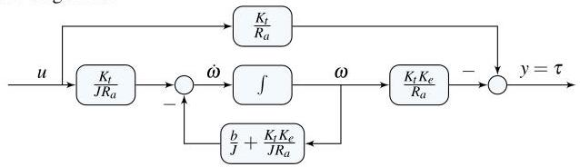

# Solution

## Method
, the rotor dynamics are given by

\[
\dot{\omega} = - \frac{b + K_t K_e / R_a}{J}\omega + \frac{K_t}{J R_a} u,
\quad u = v_a.
\]

The torque output is

\[
y = \tau = K_t i_a = \frac{K_t}{R_a} u - \frac{K_t K_e}{R_a}\omega.
\]

Choosing the angular velocity as the state variable,

\[
x = \omega,
\]

a possible state-space representation is

\[
A = - \frac{b}{J} - \frac{K_t K_e}{J R_a},\quad
B = \frac{K_t}{J R_a},
\]

\[
C = - \frac{K_t K_e}{R_a},\quad
D = \frac{K_t}{R_a}.
\]

The associated transfer function is

\[
G(s) = C (sI - A)^{-1} B + D
\]

\[
= \frac{K_t}{R_a} - 
\frac{\frac{K_t}{J R_a} \cdot \frac{K_t K_e}{R_a}}
{s + \frac{b}{J} + \frac{K_t K_e}{J R_a}}
\]

\[
= \frac{K_t}{R_a}
\left(
1 -
\frac{\frac{K_t K_e}{J R_a}}
{s + \frac{b}{J} + \frac{K_t K_e}{J R_a}}
\right)
\]

\[
= \frac{K_t}{R_a}
\frac{s + \frac{b}{J}}
{s + \frac{b}{J} + \frac{K_e K_t}{J R_a}}.
\]

This transfer function is identical to that obtained in P4.34, confirming consistency between the state-space and frequency-domain analyses.

A possible block-diagram realization is shown below.

## Teaching Points
1. Relationship between electrical and mechanical subsystems in DC motors
2. Output equations with direct feedthrough terms
3. Derivation of transfer functions from state-space models
4. Interpretation of zeros and poles in electromechanical systems
5. Consistency between time-domain and frequency-domain models
