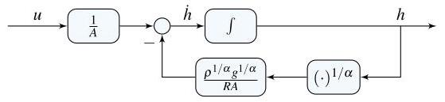

# Solution

## Method
Combining the inflow and outflow expressions yields

\[
\dot{h} = \frac{1}{A} w_{\text{in}} - \frac{1}{A} w_{\text{out}}, \quad u = w_{\text{in}}.
\]

Substituting the outflow model gives

\[
\dot{h}
= \frac{1}{A} u
-\frac{1}{R A} \left( p_{\mathrm{t}} - p_{\mathrm{a}} \right)^{1/\alpha}.
\]

Using the pressure relation \( p_{\mathrm{t}} - p_{\mathrm{a}} = \rho g h \), the equation becomes

\[
\dot{h}
= \frac{1}{A} u
-\frac{\rho^{1/\alpha} g^{1/\alpha}}{R A} h^{1/\alpha}.
\]

Letting the state and output be

\[
x = h, \quad y = h,
\]

a possible nonlinear state-space representation is

\[
\dot{x}
= \frac{1}{A} u
-\frac{\rho^{1/\alpha} g^{1/\alpha}}{R A} x^{1/\alpha},
\quad
y = x.
\]

The corresponding block-diagram consists of a single integrator generating the water level \( h \), with a nonlinear feedback term proportional to \( h^{1/\alpha} \) representing the outflow through the orifice.

## Teaching Points
1. Modeling of physical systems with nonlinear flow relations
2. Construction of nonlinear state-space models
3. Interpretation of pressure-driven outflow dynamics
4. Use of integrators in fluid system block diagrams
5. Distinction between linear and nonlinear system behavior
