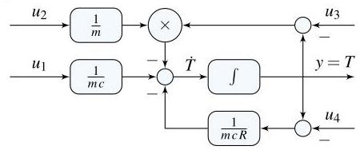

# Solution

## Method
Isolate the highest derivative:

\[
\dot{T} = \frac{1}{mc}{u}_{1} + \frac{1}{m}{u}_{2}\left( {{u}_{3} - T}\right) + \frac{1}{mcR}\left( {{u}_{4} - T}\right),
\]

\[
{u}_{1} = q,\; {u}_{2} = w,\; {u}_{3} = {T}_{i},\; {u}_{4} = {T}_{o},
\]

\[
y = T
\]

A possible nonlinear state-space representation is:

\[
x = T,\;
f\left( {x, u}\right) = \frac{1}{mc}{u}_{1} + \frac{1}{m}{u}_{2}\left( {{u}_{3} - T}\right) + \frac{1}{mcR}\left( {{u}_{4} - T}\right),\;
g\left( {x, u}\right) = x
\]

A possible block-diagram is:

## Teaching Points
1. Energy balance modeling of thermal systems
2. Identification of nonlinearities arising from variable flow rates
3. Representation of physical systems using state-space models
4. Construction of block-diagrams using integrators
5. Interpretation of inputs and states in thermodynamic systems
