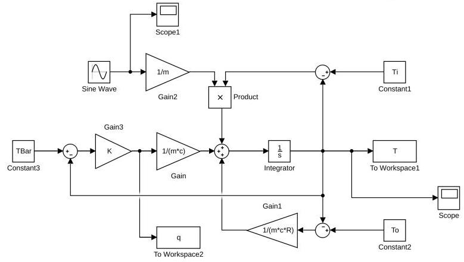
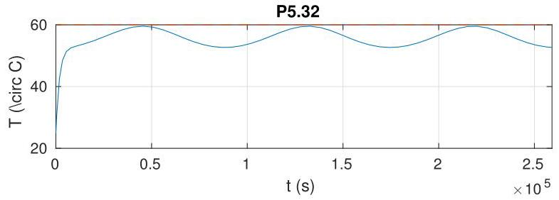
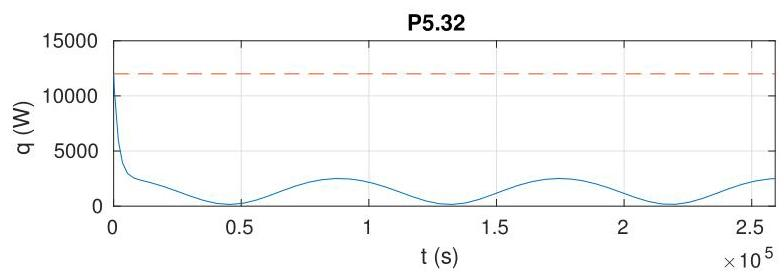

# Solution

## Method
For this problem we need first to choose and operating point for linearization. A sensible choice is

\[
\bar{T} = {60}^{ \circ  }\mathrm{C},\;{\bar{u}}_{2} = \bar{w} = {20}\mathrm{{gal}}/\mathrm{h},\;{\bar{u}}_{3} = {25}^{ \circ  }\mathrm{C},\;{\bar{u}}_{4} = {25}^{ \circ  }\mathrm{C}\text{ , }
\]

from which

\[
{\bar{u}}_{1} = \left( {1/R + c{\bar{u}}_{2}}\right) \bar{T} - \left( {c{\bar{u}}_{2}{\bar{u}}_{3} + {\bar{u}}_{4}/R}\right) .
\]

With these values we have calculate the transfer-functions

\[
G\left( s\right)  = \frac{T\left( s\right) }{Q\left( s\right) } = \frac{\beta }{s + \alpha }
\]

\[
K\left( s\right)  = K
\]

where

\[
\alpha  = \frac{{\bar{u}}_{2}}{m} + \frac{1}{mcR} = \frac{\bar{w}}{m} + \frac{1}{mcR},
\]

\[
\beta  = \frac{1}{mc},
\]

so that

\[
S\left( s\right)  = \frac{1}{1 + G\left( s\right) K\left( s\right) } = \frac{s + \alpha }{s + \alpha  + {K\beta }},
\]

which means the closed-loop system is internally stable for all \( K >  - \alpha /\beta \) . As in Chapter 4 we choose \( K = {342} > \alpha /\beta  = {91.4} \) The time-constants are the same as in P4.39.

For simulation of the closed-loop nonlinear model we use the Simulink diagram:

In closed-loop, starting at \( T\left( 0\right)  = {T}_{o} = {25}^{ \circ  }\mathrm{C} \) with reference \( \bar{T} = {60}^{ \circ  }\mathrm{C} \) the closed-loop response should look like:

The average temperature on the three days is \( {54.4}^{ \circ  }\mathrm{C} \) and \( {55.8}^{ \circ  }\mathrm{C} \) in the last two days.

Given that we don't have any open-loop poles at the origin, the closed-loop system is not capable of asymptotically tracking a constant reference signal. Note the small tracking error due to the relatively large gain though.

The control output looks like

confirming that the maximum power is never exceeded.

Compared with P4.42, which uses an approximation, the closed-loop response is actually better than the one predicted by the approximation.

NOTE: The above result was obtained by simulating the closed-loop response using the nonlinear model from P5.36! This is not clearly stated in the problem.

## Teaching Points

1. Selection of operating points for linearization of nonlinear thermal systems
2. Relationship between proportional control gain and closed-loop stability
3. Interpretation of time constants in thermal control systems
4. Limitations of proportional control for reference tracking
5. Importance of actuator saturation constraints
6. Differences between linearized analysis and nonlinear simulation
7. Effect of periodic disturbances on closed-loop performance
8. Validation of approximate models using nonlinear simulations
