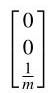

# Solution

## Method
If only tangential trust is used then

\[
\dot{\widetilde{x}} = \left\lbrack  \begin{matrix} 0 & 1 & 0 \\  3{\Omega }^{2} & 0 & {2\Omega } \\  0 &  - {2\Omega } & 0 \end{matrix}\right\rbrack  \widetilde{x} + \left\lbrack  \begin{matrix} 0 \\  0 \\  \frac{1}{m} \end{matrix}\right\rbrack  {u}_{t}.
\]

The remaining eigenvalues are \( - {j\Omega } \) and \( {j\Omega } \) , with corresponding left-eigenvectors

\[
\left( \begin{array}{lll} {3\Omega }/2 &  - j/2 & 1 \end{array}\right) ,\;\left( \begin{array}{lll} {3\Omega }/2 & j/2 & 1 \end{array}\right)
\]

Since the cross-product of these eigenvalues with the matrix

is never zero the system is controllable.

## Teaching Points
1. Eigenvalue-based controllability analysis for linear systems
2. Role of tangential thrust in modifying orbital energy and phase
3. Relationship between actuator direction and controllable modes
4. Comparison between radial-only and tangential-only actuation
5. Physical interpretation of mathematical controllability results
