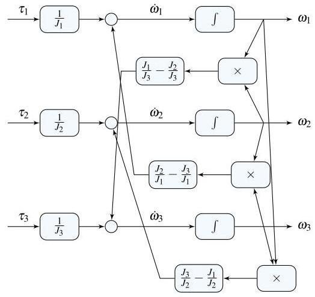

# Solution

## Method
Isolate the highest derivatives:

\[
{\dot{\omega }}_{1} = {\omega }_{2}{\omega }_{3}\left( {{J}_{2}/{J}_{1} - {J}_{3}/{J}_{1}}\right)  + {\tau }_{1}/{J}_{1},
\]

\[
{\dot{\omega }}_{2} = {\omega }_{1}{\omega }_{3}\left( {{J}_{3}/{J}_{2} - {J}_{1}/{J}_{2}}\right)  + {\tau }_{2}/{J}_{2},
\]

\[
{\dot{\omega }}_{3} = {\omega }_{1}{\omega }_{2}\left( {{J}_{1}/{J}_{3} - {J}_{2}/{J}_{3}}\right)  + {\tau }_{3}/{J}_{3},
\]

\[
y = \omega
\]

A possible nonlinear state-space representation is:

\[
x = \omega ,\;u = \tau ,\;f\left( {x, u}\right)  = \left( \begin{array}{l} {\omega }_{2}{\omega }_{3}\left( {{J}_{2}/{J}_{1} - {J}_{3}/{J}_{1}}\right)  + {\tau }_{1}/{J}_{1} \\  {\omega }_{1}{\omega }_{3}\left( {{J}_{3}/{J}_{2} - {J}_{1}/{J}_{2}}\right)  + {\tau }_{2}/{J}_{2} \\  {\omega }_{1}{\omega }_{2}\left( {{J}_{1}/{J}_{3} - {J}_{2}/{J}_{3}}\right)  + {\tau }_{3}/{J}_{3} \end{array}\right) ,\;g\left( {x, u}\right)  = x
\]

A possible block-diagram is:

## Teaching Points

1. Formulation of rigid-body rotational dynamics using Euler’s equations
2. Representation of multivariable nonlinear systems in state-space form
3. Physical interpretation of gyroscopic coupling terms
4. Construction of block-diagrams for nonlinear vector systems
5. Distinction between linear inertia effects and nonlinear cross-product terms
