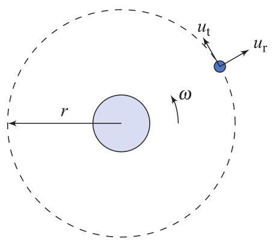

# Problem

## Problem Description

The equations

\[
m\left( \ddot{r} - r\omega^{2} \right) = u_{\mathrm{r}} - \frac{GMm}{r^{2}}
\]

\[
m\left( 2\dot{r}\omega + r\dot{\omega} \right) = u_{\mathrm{t}}
\]

are a simplified description of the motion of a satellite orbiting Earth, as shown in Fig. 5.18. Here, \( r \) is the satellite’s radial distance from the center of the Earth, \( \omega \) is the satellite’s angular velocity, \( m \) is the mass of the satellite, \( M \) is the mass of the Earth, \( G \) is the universal gravitational constant, \( u_{\mathrm{t}} \) is a force applied by a thruster in the tangential direction, and \( u_{\mathrm{r}} \) is a force applied by a thruster in the radial direction.

Represent these equations in a block-diagram using only integrators and rewrite the differential equations in state-space form.

*Figure 5.18 Satellite in orbit.*

## Subproblems

1. Isolate the highest-order derivatives in the given equations.
2. Express the radial and angula
