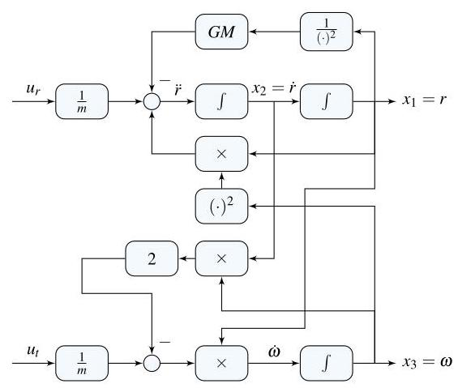

# Solution

## Method
Isolate the highest derivatives:

\[
\ddot{r} = r{\omega }^{2} + \frac{1}{m}{u}_{r} - \frac{GM}{{r}^{2}}
\]

\[
\dot{\omega } =  - \frac{2\dot{r}\omega }{r} + \frac{1}{mr}{u}_{t}
\]

A possible nonlinear state-space representation is:

\[
x = \left( \begin{matrix} r \\  \dot{r} \\  \omega  \end{matrix}\right) ,\;f\left( {x, u}\right)  = \left( \begin{matrix} {x}_{2} \\  {x}_{1}{x}_{3}^{2} + \frac{1}{m}{u}_{r} - \frac{GM}{{x}_{1}^{2}} \\   - \frac{2{x}_{2}{x}_{3}}{{x}_{1}} + \frac{1}{m{x}_{1}}{u}_{t} \end{matrix}\right) .
\]

A possible block-diagram is:

\[
0 = {\bar{x}}_{2}
\]

\[
0 = {\bar{x}}_{1}{\bar{x}}_{3}^{2} - \frac{GM}{{\bar{x}}_{1}^{2}}
\]

\[
0 =  - \frac{2{\bar{x}}_{2}{\bar{x}}_{3}}{{\bar{x}}_{1}}
\]

## Teaching Points

1. Modeling orbital dynamics using polar coordinates
2. Conversion of second-order nonlinear equations to state-space form
3. Representation of gravitational, centrifugal, and Coriolis effects
4. Construction of nonlinear block-diagrams using integrators
5. Physical interpretation of coupled radial and angular motion
