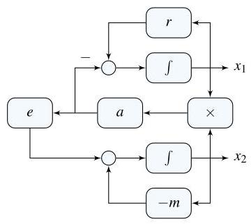
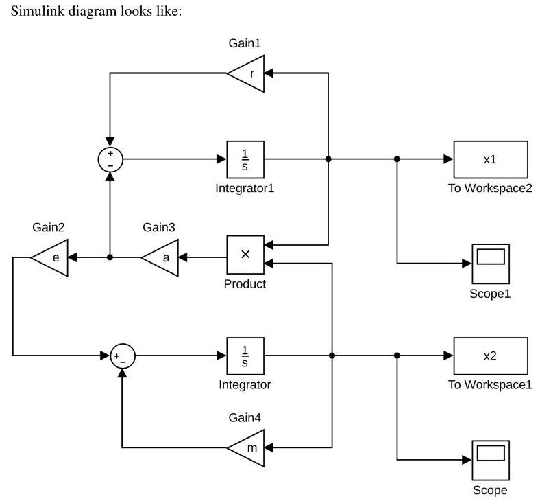
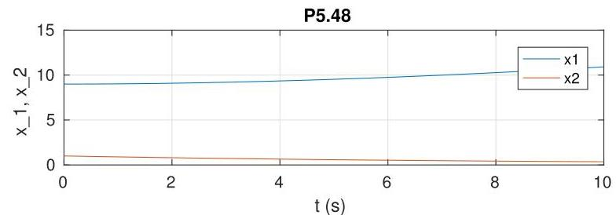
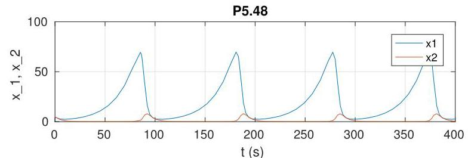
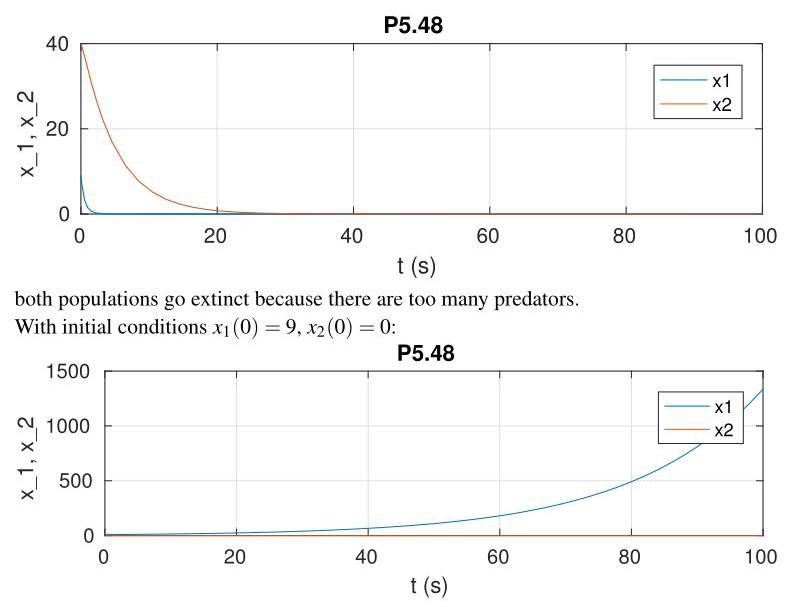

# Solution

## Method

This is a nonlinear model:

\[
\dot{x}\left( t\right)  = f\left( x\right) ,
\]

\[
f\left( x\right)  = \left( \begin{matrix} r{x}_{1} - a{x}_{1}{x}_{2} \\  {ea}{x}_{1}{x}_{2} - m{x}_{2} \end{matrix}\right)
\]

At equilibrium:

\[
r{\bar{x}}_{1} - a{\bar{x}}_{1}{\bar{x}}_{2} = 0
\]

\[
{ea}{\bar{x}}_{1}{\bar{x}}_{2} - m{\bar{x}}_{2} = 0
\]

which has as solutions the two possible equilibrium points:

\[
\left( {{\bar{x}}_{1},{\bar{x}}_{2}}\right)  = \left( {0,0}\right) ,
\]

\[
\left( {{\bar{x}}_{1},{\bar{x}}_{2}}\right)  = \left( {m/\left( {ae}\right) , r/a}\right)
\]

Linearization about equilibrium leads to:

\[
A = {\left. {\partial }_{x}f\left( x, u\right) \right| }_{x = \bar{x}, u = \bar{u}} = \left\lbrack  \begin{matrix} r - a{\bar{x}}_{2} &  - a{\bar{x}}_{1} \\  {ea}{\bar{x}}_{2} &  - m + {ea}{\bar{x}}_{1} \end{matrix}\right\rbrack
\]

When \( \left( {{\bar{x}}_{1},{\bar{x}}_{2}}\right)  = \left( {0,0}\right) \)

\[
A = \left\lbrack  \begin{matrix} r & 0 \\  0 &  - m \end{matrix}\right\rbrack
\]

which has eigenvalues the roots of the polynomial:

\[
\det \left( {{\lambda I} - A}\right)  = \left| \begin{matrix} \lambda  - r & 0 \\  0 & \lambda  + m \end{matrix}\right|  = \left( {\lambda  - r}\right) \left( {\lambda  + m}\right)  = 0
\]

of which one root \( \lambda  = r > 0 \) has positive real part, hence the equilibrium point is unstable.

When \( \left( {{\bar{x}}_{1},{\bar{x}}_{2}}\right)  = \left( {m/\left( {ae}\right) , r/a}\right) \)

\[
A = {\left. {\partial }_{x}f\left( x, u\right) \right| }_{x = \bar{x}, u = \bar{u}} = \left\lbrack  \begin{matrix} 0 &  - m/e \\  {er} & 0 \end{matrix}\right\rbrack
\]

which has eigenvalues the roots of the polynomial:

\[
\det \left( {{\lambda I} - A}\right)  = \left| \begin{matrix} \lambda & m/e \\   - {er} & \lambda  \end{matrix}\right|  = {\lambda }^{2} + {mr} = \left( {\lambda  + j\sqrt{mr}}\right) \left( {\lambda  - j\sqrt{mr}}\right)  = 0
\]

which are on the imaginary axis.

A possible block-diagram is:

and the result of the simulation with initial conditions \( x_{1}(0) = 9, x_{2}(0) = 1 \):

Note that both populations reach a constant equilibrium.

With initial conditions \( x_{1}(0) = 5, x_{2}(0) = 5 \):

the populations oscillate.

With initial conditions \( x_{1}(0) = 9, x_{2}(0) = 40 \):

the prey population grows unbounded since there are no predators.

## Teaching Points

1. Equilibrium analysis of nonlinear population models
2. Linearization using Jacobian matrices
3. Interpretation of eigenvalues in stability analysis
4. Predator–prey interaction dynamics
5. Sensitivity of nonlinear systems to initial conditions
