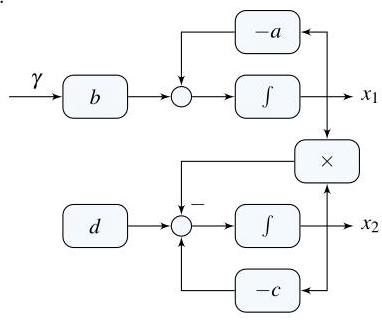

# Solution

## Method
At equilibrium:

\[
-a{\bar{x}}_{1} + b\overline{\gamma } = 0
\]

\[
-\left( {c + {\bar{x}}_{1}}\right) {\bar{x}}_{2} + d = 0
\]

so that

\[
{\bar{x}}_{1} = \frac{b}{a}\overline{\gamma } > 0,
\]

and

\[
{\bar{x}}_{2} = \frac{d}{c + {\bar{x}}_{1}} > 0.
\]

A possible block-diagram is:

## Teaching Points
1. **Equilibrium of Nonlinear Systems**: Understanding that steady-state (equilibrium) occurs when the rate of change (\( \dot{x} \)) is zero.
2. **Coupled Equations**: Analyzing how the steady-state value of one variable (\( x_1 \)) directly influences the steady-state value of another (\( x_2 \)).
3. **Block Diagram Construction**: Learning how to translate mathematical ODEs into a visual control flow, highlighting the use of feedback and integrators to represent dynamics.
4. **Biological Modeling**: Introducing how chemical/hormonal concentrations in the body can be modeled using standard control theory tools.