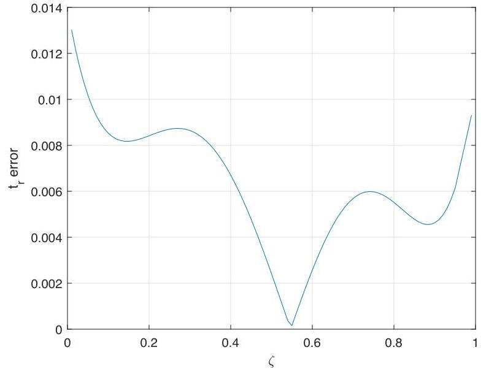
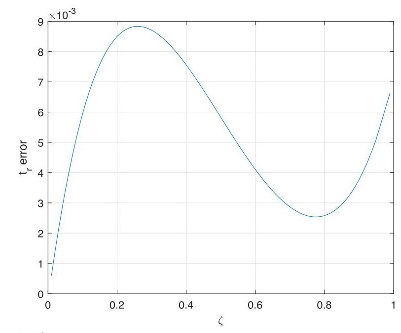

# Solution

## Method

Graph of the errors should look like this:

for \( {t}_{r}/{t}_{n} \) and

for \( {t}_{s}/{t}_{n} \).

**Interpretation of the Graphs:**
1.  **Graph 1 (Rise Time Error):** The plot shows the relative error for an approximate formula of \( t_r / t_n \) (where \( t_n = 2\pi/\omega_n \) is a natural period) versus damping ratio \(\zeta\). The error curve remains within a narrow band. Its maximum absolute value is clearly below the 1% threshold line across the entire range \(0 < \zeta < 1\).
2.  **Graph 2 (Settling Time Error):** The plot shows the relative error for an approximate formula of \( t_s / t_n \) versus damping ratio \(\zeta\). Similar to the first graph, the error curve oscillates but its envelope stays consistently below the 1% line for all \(\zeta\) in the specified range.

**Verification Conclusion:** By visually inspecting the provided error plots, the maximum amplitude of the relative error for both the rise time and settling time approximations is less than 1% for all \(0 < \zeta < 1\). Therefore, the claim is verified graphically.

## Teaching Points
1.  **Purpose of Approximations:** Complex time-domain specifications like rise time and settling time often lack simple closed-form solutions. Engineers use approximate formulas (like those in (6.11)) for quick, hand-calculation based design and intuition.
2.  **Quantifying Approximation Accuracy:** The **relative error** is the standard metric to assess the quality of an approximation. A stated bound (e.g., "< 1%") defines its region of usefulness.
3.  **Graphical Verification vs. Analytical Proof:** For complex functions of a parameter (\(\zeta\)), it can be easier to verify an error bound graphically over a continuous range than to prove it analytically. The graph provides immediate visual confirmation.
4.  **Reading Error Plots:** Key elements to identify on such plots are: the error curve itself, the horizontal axis (\(\zeta\)), the vertical axis (% error), and any reference lines (like the ±1% lines). The verification is complete if the error curve never crosses the reference bound.
5.  **Context of Use:** Understanding the error bounds of common approximations is crucial. Knowing that an approximation is accurate to within 1% gives confidence when using it for initial system design and tuning.

