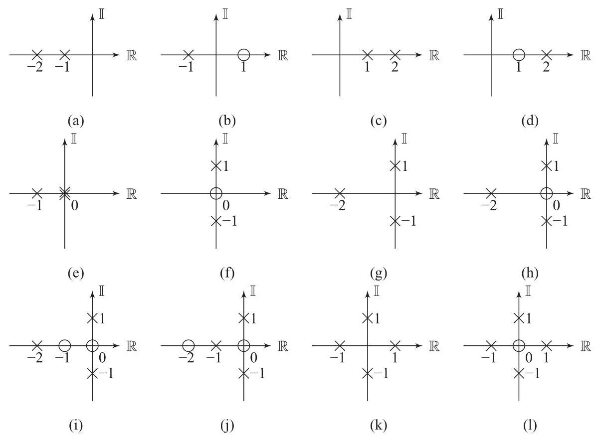

# Problem

## Problem Description

Sketch the root-locus for the SISO systems with poles and zeros shown in Fig. 6.25 then use MATLAB to verify your answer.

Figure 6.25 Pole-zero diagrams for P6.7.

## Subproblems

1. Identify the open-loop poles and zeros from each pole-zero diagram.
2. Determine the number of root-locus branches for each system.
3. Apply the root-locus rules to determine asymptotes and breakaway points.
4. Sketch the qualitative root-locus trajectories in the complex plane.
5. Analyze how closed-loop pole locations change with increasing gain.
6. Use MATLAB root-locus tools to verify the analytical sketches.

## Additional Information

- All systems are single-input single-output (SISO).
- The gain is assumed to be real and nonnegative.
- Standard root-locus construction rules apply.
- MATLAB’s `rlocus` command may be used for verification.

## Constraints

- Sketches should reflect qualitative trends rather than exact numerical precision.
- Root-locus rules must be applied consistently.
- MATLAB verification should confirm, not replace, analytical reasoning.
- Complex-conjugate symmetry must be preserved where applicable.
