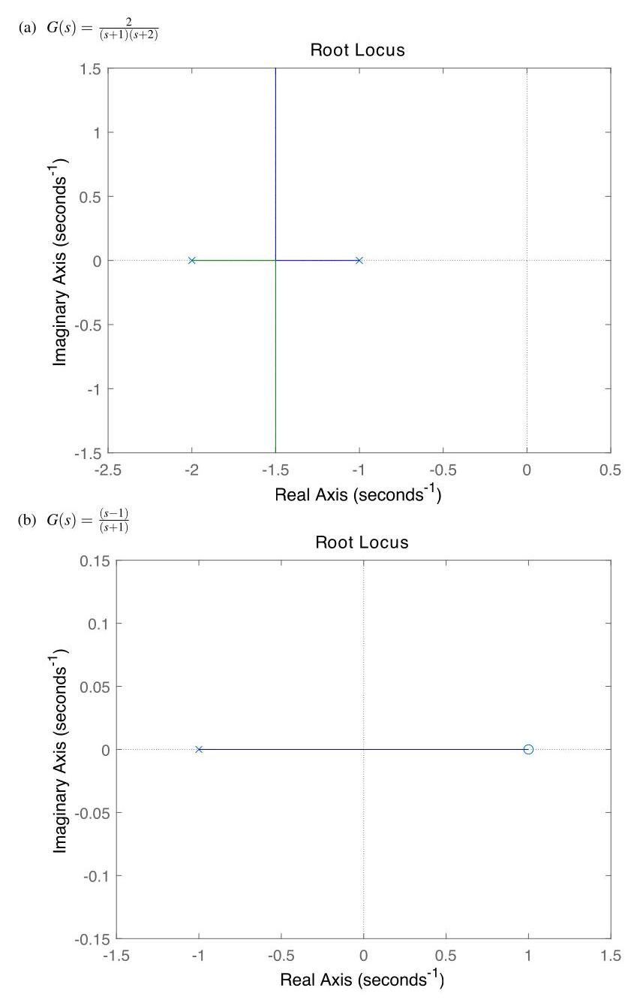
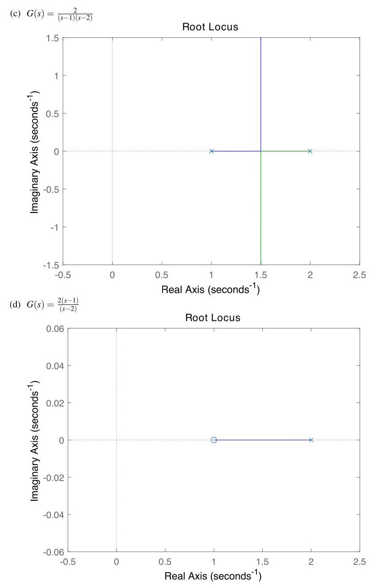
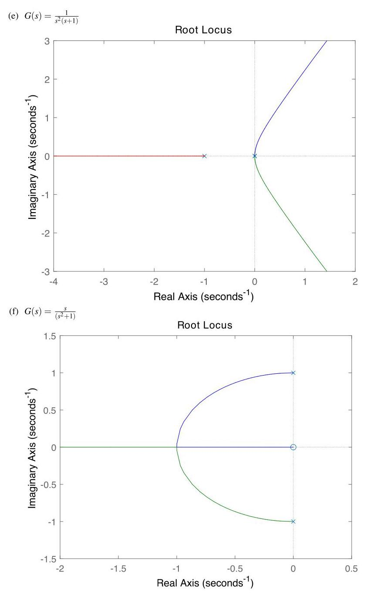
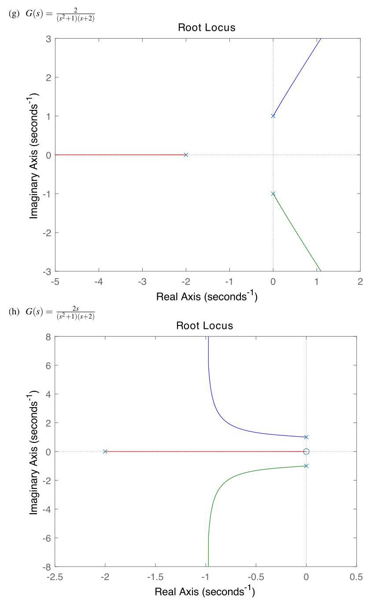
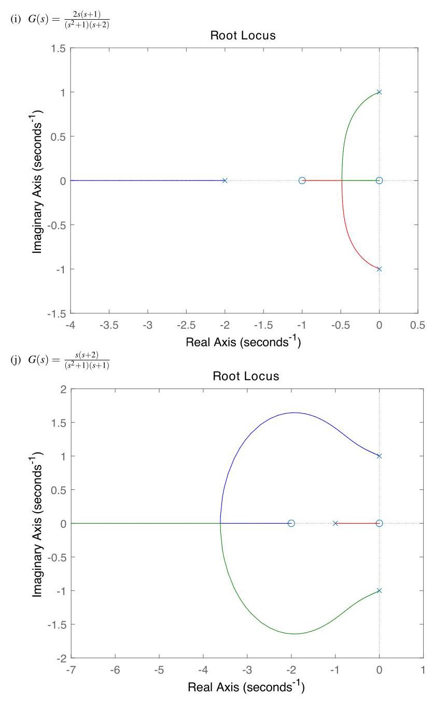
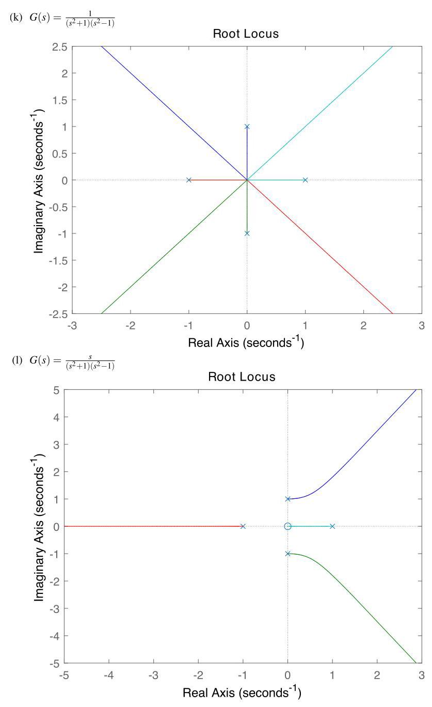

# Solution

## Method

Solutions should be as in:

\[
{J}_{r}\ddot{\theta } + b\dot{\theta } + {mgr}\sin \theta  + {K\theta } = {Kr}.
\]

## Teaching Points

1. Interpretation of pole-zero configurations and their impact on root-locus shape.
2. Application of root-locus construction rules for SISO systems.
3. Relationship between open-loop dynamics and closed-loop stability.
4. Use of graphical tools to complement analytical control design.
5. Validation of theoretical sketches using computational software such as MATLAB.
