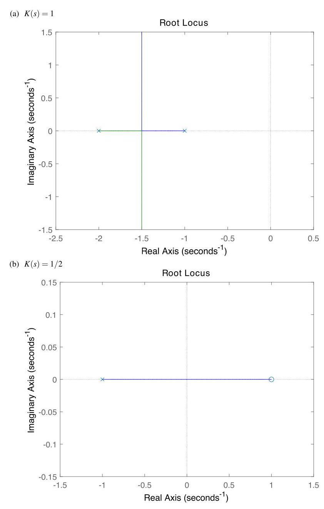
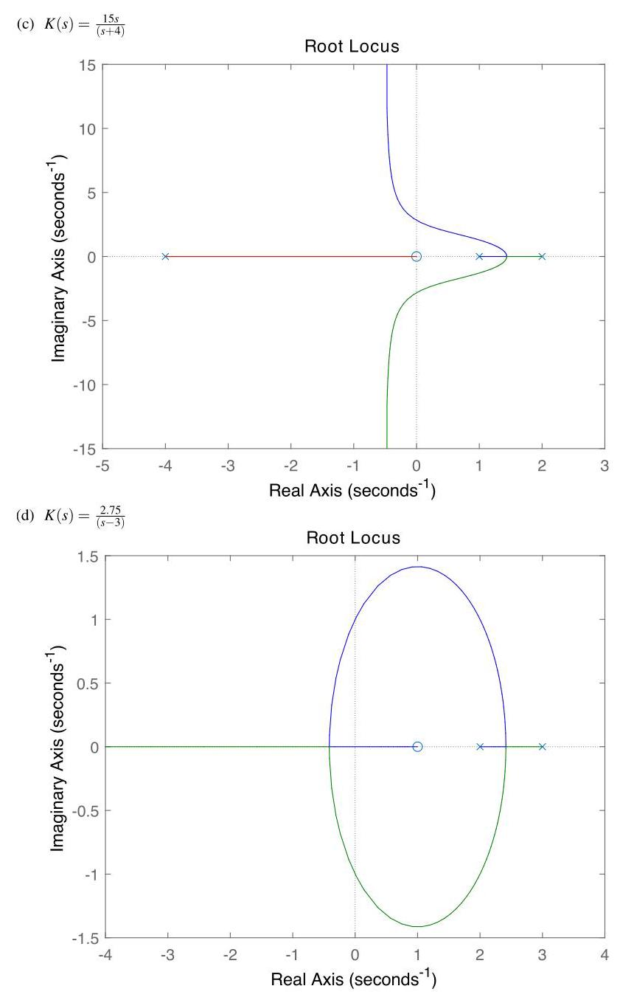
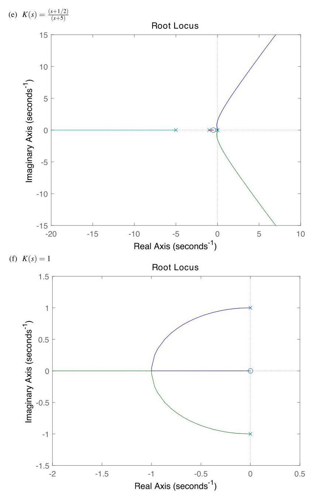
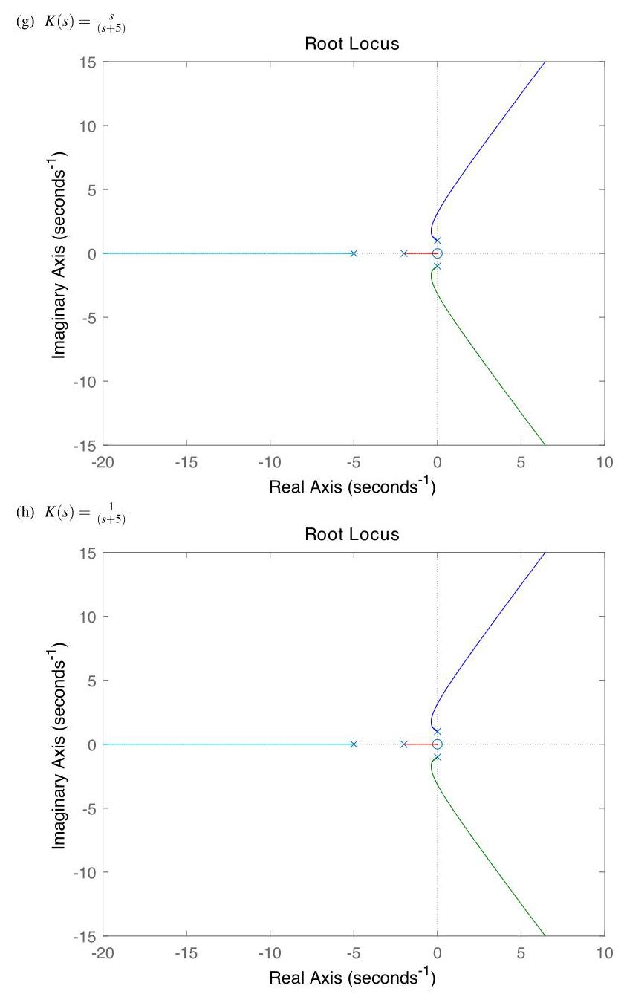
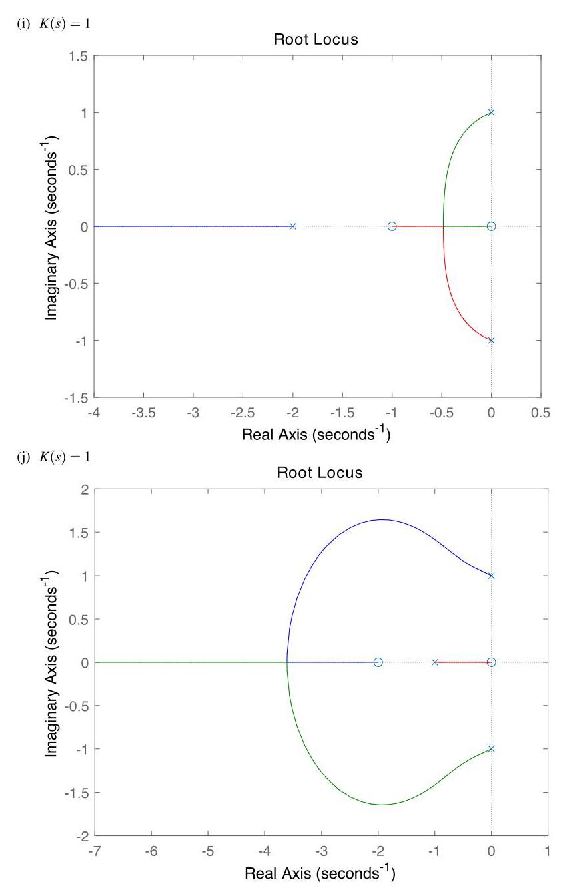
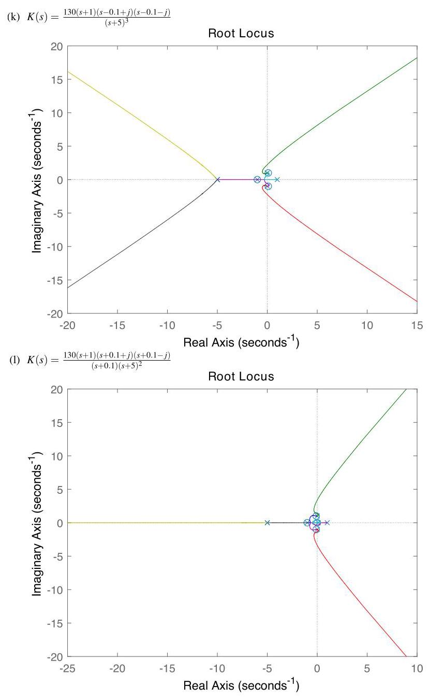

# Solution

## Method

Possible solutions are:

## Teaching Points

1. Use of root-locus techniques for feedback controller design.
2. Distinction between plant stability and controller stability.
3. Importance of avoiding right-half-plane pole-zero cancellation.
4. Role of dynamic compensation when static gain is insufficient.
5. Recognition that stabilizing a system may require nontrivial controller structures.
