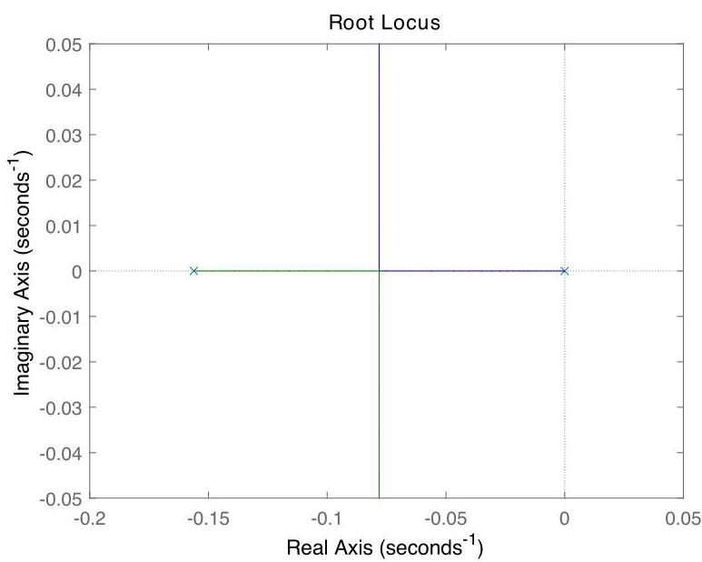

# Solution

## Method

We have

\[
G\left( s\right)  = \beta /\left( {s + \alpha }\right)
\]

with parameters

\[
\alpha  = \frac{{b}_{1}{r}_{2}^{2} + {b}_{2}{r}_{1}^{2}}{{J}_{1}{r}_{2}^{2} + {J}_{2}{r}_{1}^{2}},\;\beta  = \frac{{r}_{1}{r}_{2}}{{J}_{1}{r}_{2}^{2} + {J}_{2}{r}_{1}^{2}}.
\]

The controller transfer-function is $ K\left( s\right)  = {K}_{i}/s $ and the loop transfer-function

\[
L(s) = G(s)K(s) = \frac{\beta }{s\left( {s + \alpha }\right) }
\]

has poles at $ \{ -\alpha, 0 \} $ and no finite zeros.

For the given data the root-locus plot starts at these two poles and evolves as $K_i$ increases. The characteristic equation becomes:

\[
1 + {K}_{i}L(s) = 1 + \frac{{K}_{i}\beta }{s\left( {s + \alpha }\right) } = \frac{{s}^{2} + {\alpha s} + {K}_{i}\beta }{s\left( {s + \alpha }\right) }.
\]

Closed-loop poles are the roots of $ s^2 + \alpha s + K_i\beta = 0 $. These poles are real when the discriminant is non-negative:

\[
\alpha^2 - 4K_i\beta \geq 0.
\]

They become repeated (and thus maximally damped) when equality holds:

\[
\alpha^2 - 4K_i\beta = 0 \quad \Rightarrow \quad K_i = \frac{\alpha^2}{4\beta}.
\]

At this gain, both poles are located at $ s = -\alpha/2 $, which is the breakaway point on the real axis — the farthest left they can go while remaining real.

To assess asymptotic tracking of a constant reference $ \bar{\omega}_2 $, note that the I-controller includes an integrator ($1/s$), which ensures zero steady-state error for step inputs due to the internal model principle.

Similarly, for rejection of a constant input torque disturbance, the integrator in the forward path also provides perfect rejection in steady state, because low-frequency disturbances are integrated and compensated over time.

Therefore:
- Choose $ K_i = \dfrac{\alpha^2}{4\beta} $ for optimal damping with real poles.
- Asymptotic tracking of constant references is achieved.
- Constant input torque disturbances are asymptotically rejected.

## Teaching Points
1. **Design via Root Locus**: Demonstrates how to use root locus to place poles optimally — specifically choosing the breakaway point for maximum damping.
2. **Role of Integrators in Control**: Highlights that including an integrator (I action) enables both reference tracking and disturbance rejection of constant signals.
3. **Breakaway Point Significance**: Emphasizes that the branching point on the real axis corresponds to critically damped behavior, often desired in control design.
4. **Transfer Function Derivation from Physical Models**: Reinforces deriving dynamic models from mechanical systems involving inertia, damping, and gear ratios.
5. **Steady-State Performance Analysis**: Connects controller structure (pole at origin) with long-term behavior using fundamental principles like the final value theorem and internal model principle.
