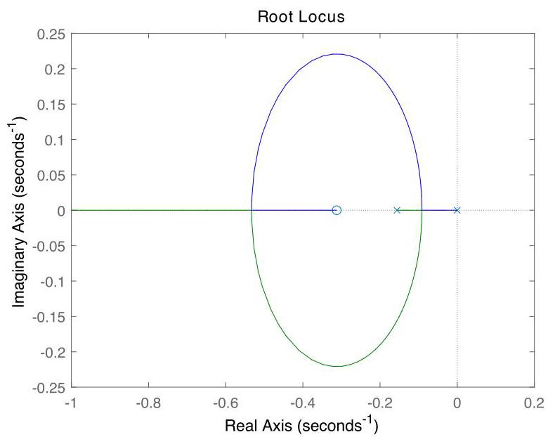

# Solution

## Method

We now have

\[
K\left( s\right)  = \frac{{K}_{i} + {K}_{p}s}{s} = \frac{{K}_{p}\left( {s + z}\right) }{s},\;z = {K}_{i}/{K}_{p}.
\]

The loop transfer-function

\[
L(s) = K(s)G(s) = \frac{{K}_{p}(s + z)}{s} \cdot \frac{\beta}{s + \alpha} = \frac{\beta K_p (s + z)}{s(s + \alpha)}
\]

has poles at $ \{ -\alpha, 0 \} $ and a zero at $ -z $. The characteristic equation is:

\[
1 + L(s) = 1 + \frac{\beta K_p (s + z)}{s(s + \alpha)} = 0
\quad \Rightarrow \quad
s(s + \alpha) + \beta K_p (s + z) = 0.
\]

Expanding:
\[
s^2 + (\alpha + \beta K_p)s + \beta K_p z = 0.
\]

To ensure both closed-loop poles have real parts more negative than $-\alpha$, we must shape the root locus so that the branches move significantly leftward. This can be achieved if the controller zero is placed to the left of $-\alpha$, i.e., $z > \alpha$. Choosing $z = 2\alpha$ pulls the root locus toward the left half-plane.

With this choice, the root locus starts at $0$ and $-\alpha$, and one branch terminates at $-z = -2\alpha$, while the other goes to infinity along the real axis. For sufficiently large $K_p$, both roots will lie to the left of $-\alpha$, satisfying the performance requirement.

For example, setting $K_p = 1$ (assuming appropriate scaling from $\beta$) results in dominant poles with real parts less than $-\alpha$, confirmed via root-locus plot:

As in P6.11, the integrator in the PI controller (pole at origin) ensures asymptotic tracking of constant reference inputs $ \bar{\omega}_2 $. By the internal model principle, integrating the error guarantees zero steady-state error for step references.

Additionally, since the disturbance enters at the input and the controller contains an integrator, constant torque disturbances are also rejected asymptotically.

Therefore:
- Set $z = K_i/K_p > \alpha$, e.g., $z = 2\alpha$
- Choose $K_p$ large enough (e.g., $K_p = 1$) to push poles left of $-\alpha$
- Asymptotic tracking of constant reference is achieved
- Constant input disturbance rejection is also ensured

## Teaching Points
1. **Advantage of PI over I Control**: Shows how adding a zero via proportional action improves transient response and allows pole placement beyond what pure integral control permits.
2. **Zero Placement Strategy**: Demonstrates that placing the controller zero to the left of the slowest plant pole enhances stability margins and speeds up response.
3. **Avoidance of Pole-Zero Cancellation**: Emphasizes robust design — avoiding cancellations preserves system controllability and avoids hidden instability risks.
4. **Root Locus Shape Modification**: Illustrates how adding a finite zero bends the root locus toward the left-half plane, enabling better performance.
5. **Internal Model Principle Application**: Reinforces that integrators in the forward path provide both reference tracking and input disturbance rejection for DC signals.
