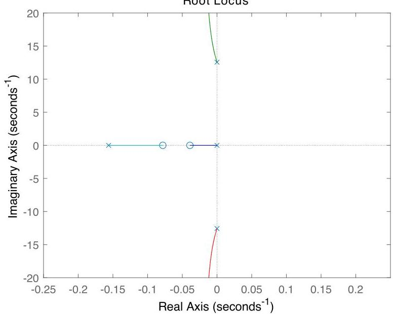

# Solution

## Method

Following the steps in P2.10, one obtains:

\[
{J}_{1}{\dot{\omega }}_{1} + {b}_{1}{\omega }_{1} = {\tau }_{1} + {f}_{1}{r}_{1} - {f}_{2}{r}_{1},
\]

\[
{J}_{2}{\dot{\omega }}_{2} + {b}_{2}{\omega }_{2} = {\tau }_{2} + {f}_{2}{r}_{2} - {f}_{1}{r}_{2}
\]

Since the inertias are coupled by a belt without slip, the linear speeds must be equal:

\[
{\omega }_{1}{r}_{1} = {\omega }_{2}{r}_{2}\; \Rightarrow  \;{\omega }_{2} = \left( {{r}_{1}/{r}_{2}}\right) {\omega }_{1}.
\]

Multiplying the first equation by $ r_2 $ and the second by $ r_1 $:

\[
{r}_{2}{J}_{1}{\dot{\omega }}_{1} + {r}_{2}{b}_{1}{\omega }_{1} = {r}_{2}{\tau }_{1} + {f}_{1}{r}_{1}{r}_{2} - {f}_{2}{r}_{1}{r}_{2},
\]

\[
{r}_{1}{J}_{2}{\dot{\omega }}_{2} + {r}_{1}{b}_{2}{\omega }_{2} = {r}_{1}{\tau }_{2} + {f}_{2}{r}_{1}{r}_{2} - {f}_{1}{r}_{1}{r}_{2}
\]

Adding them eliminates the coupling forces $ f_1, f_2 $:

\[
{r}_{2}{J}_{1}{\dot{\omega }}_{1} + {r}_{1}{J}_{2}{\dot{\omega }}_{2} + {r}_{2}{b}_{1}{\omega }_{1} + {r}_{1}{b}_{2}{\omega }_{2} = {r}_{2}{\tau }_{1} + {r}_{1}{\tau }_{2}
\]

Substitute $ \omega_2 = (r_1/r_2)\omega_1 $ and $ \dot{\omega}_2 = (r_1/r_2)\dot{\omega}_1 $:

\[
{r}_{2}{J}_{1}{\dot{\omega }}_{1} + {r}_{1} \cdot {J}_{2} \cdot \frac{{r}_{1}}{{r}_{2}}{\dot{\omega }}_{1} + {r}_{2}{b}_{1}{\omega }_{1} + {r}_{1} \cdot {b}_{2} \cdot \frac{{r}_{1}}{{r}_{2}}{\omega }_{1} = {r}_{2}{\tau } + {r}_{1}{\tau }_{2}
\]

Multiply both sides by $ r_2 $:

\[
\left( {{J}_{1}{r}_{2}^{2} + {J}_{2}{r}_{1}^{2}}\right) {\dot{\omega }}_{1} + \left( {{b}_{1}{r}_{2}^{2} + {b}_{2}{r}_{1}^{2}}\right) {\omega }_{1} = {r}_{2}\left( {{r}_{2}\tau  + {r}_{1}{\tau }_{2}}\right)
\]

This confirms the modified equation.

Taking Laplace transforms (assuming zero initial conditions), and noting $ \omega_2 = (r_1/r_2)\omega_1 $, we get:

Let:
$$
\alpha = \frac{b_1 r_2^2 + b_2 r_1^2}{J_1 r_2^2 + J_2 r_1^2}, \quad
\beta = \frac{r_1 r_2}{J_1 r_2^2 + J_2 r_1^2}
$$

Then the open-loop transfer function from $ \tau $ to $ \omega_2 $ is:

$$
G(s) = \frac{\beta}{s + \alpha}
$$

To track a constant reference $ \bar{\omega}_2 = 4\pi $ and reject $ \tau_2(t) = h \cos(\sigma t) $ with $ \sigma = \bar{\omega}_2 = \eta $, the internal model principle requires the controller to contain:
- A pole at $ s = 0 $ → for DC tracking/rejection
- Conjugate poles at $ s = \pm j\eta $ → to generate/suppress $ \cos(\eta t) $

Thus, desired controller form:

$$
K(s) = K \frac{(s + z_1)(s + z_2)}{s(s^2 + \eta^2)}
$$

Without added zeros $ z_1, z_2 $, the root locus would have three poles on the imaginary axis ($0, \pm j\eta$) and only two elsewhere — leading to right-half-plane branches and inevitable instability.

By introducing two stable real zeros $ z_1, z_2 $, we can pull the root locus into the left-half plane.

The loop transfer function becomes:

$$
L(s) = K(s)G(s) = K \frac{(s + z_1)(s + z_2)}{s(s^2 + \eta^2)} \cdot \frac{\beta}{s + \alpha} = \frac{K\beta (s + z_1)(s + z_2)}{s(s + \alpha)(s^2 + \eta^2)}
$$

Poles: $ \{0, -\alpha, j\eta, -j\eta\} $, Zeros: $ \{-z_1, -z_2\} $

For stability, choose $ z_1 + z_2 < \alpha $ so that centroid of asymptotes lies in LHP. For example, set $ z_1 = \alpha/2, z_2 = \alpha/4 $. Then the root locus has two asymptotes going vertically downward into the open left-half plane.

Any $ K > 0 $ yields a stable closed-loop system. Moreover:
- The pole at origin ensures asymptotic tracking of constant references
- The resonant poles at $ \pm j\eta $ provide perfect rejection of $ h\cos(\eta t) $ when $ \eta = \overline{\omega}_2 $

Hence, the closed-loop achieves both objectives.

Note: While stable, the system may exhibit lightly damped oscillations unless higher-order compensation (e.g., notch filters or lead-lag networks) is introduced.

## Teaching Points
1. **Internal Model Principle in Action**: Demonstrates that to perfectly track or reject a signal, the controller must embed a model of its dynamics (e.g., integrator for step, oscillator for sine).
2. **Stabilization via Zero Placement**: Shows how unstable open-loop configurations (due to imaginary-axis poles) can be stabilized using carefully placed finite zeros.
3. **Root Locus with Complex Poles**: Extends root-locus understanding beyond real poles to systems with complex conjugate poles and their asymptotic behavior.
4. **Design Trade-offs in Dynamic Compensation**: Highlights that performance (disturbance rejection) comes at the cost of increased controller complexity and potential oscillatory transients.
5. **Physical Interpretation of Disturbances**: Reinforces modeling real-world effects like reciprocating loads in rotating machinery and designing robustness against them.
