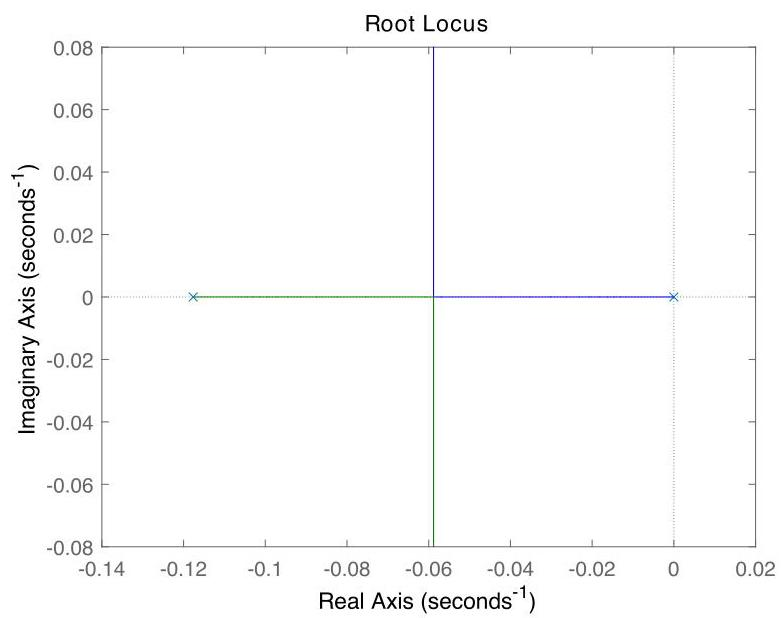

# Solution

## Method

We have

\[
{\ddot{x}}_{1} + \alpha {\dot{x}}_{1} = \beta \left( {\tau  + \gamma }\right) ,
\]

where

\[
\alpha  = \frac{{b}_{1} + {b}_{2}}{{J}_{1} + {J}_{2} + {r}^{2}\left( {{m}_{1} + {m}_{2}}\right) },\;\beta  = \frac{r}{{J}_{1} + {J}_{2} + {r}^{2}\left( {{m}_{1} + {m}_{2}}\right) },\;\gamma  = {gr}\left( {{m}_{1} - {m}_{2}}\right) .
\]

Given $ m_1 = m_2 = 1000\,\text{kg} $, it follows that $ \gamma = gr(m_1 - m_2) = 0 $. Thus, the equation simplifies to:

\[
{\ddot{x}}_{1} + \alpha {\dot{x}}_{1} = \beta \tau.
\]

Taking Laplace transform (assuming zero initial conditions):

\[
s^2 X_1(s) + \alpha s X_1(s) = \beta \Tau(s)
\quad \Rightarrow \quad
X_1(s) = \frac{\beta}{s(s + \alpha)} \Tau(s)
\]

So the open-loop transfer function from control input $ \tau $ to position output $ x_1 $ is:

\[
G(s) = \frac{\beta}{s(s + \alpha)}
\]

Let the controller be a proportional gain: $ K(s) = K $. Then the loop transfer function is:

\[
L(s) = G(s)K(s) = \frac{K\beta}{s(s + \alpha)}
\]

This has:
- Poles at $ s = 0 $ and $ s = -\alpha $
- No finite zeros

The root-locus starts at these two poles on the real axis. As $ K $ increases from 0 to $ \infty $, the two branches move toward each other along the negative real axis and remain in the left-half plane.

Since both poles stay real and negative for all $ K > 0 $, the closed-loop system is internally asymptotically stable for any positive gain.

Moreover, because the plant already contains an integrator (pole at $ s=0 $) due to velocity integration into position, and there are no external constant disturbances (since $ m_1 = m_2 $ eliminates gravitational imbalance), the system can asymptotically track a constant position reference $ \bar{x}_1 $ using even a simple P-controller.

In fact, the DC gain from $ \tau $ to $ x_1 $ is infinite (due to double pole at origin in open-loop), which ensures zero steady-state error for step inputs — provided stability holds, which it does.

Therefore:
- A P-controller suffices for asymptotic tracking
- Internal stability is guaranteed for all $ K > 0 $
- Gravitational disturbance is canceled by symmetric loading

## Teaching Points
1. **Natural Integrators in Physical Systems**: Demonstrates that mechanical integration (position as integral of velocity) introduces inherent poles at the origin, contributing to system type and steady-state performance.
2. **Role of Symmetry in Disturbance Rejection**: Highlights how balanced mass design ($ m_1 = m_2 $) passively cancels constant gravitational torque, reducing control burden.
3. **Sufficiency of Proportional Control for Type-I Plants**: Shows that even without integral action in the controller, certain systems (like position control with damping) can still achieve perfect tracking if the open-loop includes sufficient integration.
4. **Stability via Root-Locus Geometry**: Reinforces that root loci between two real poles remain stable and overdamped — ideal for safety-critical applications like elevators.
5. **Physical Interpretation of Transfer Function Structure**: Connects mathematical form $ \beta / [s(s+\alpha)] $ directly to Newtonian mechanics and energy dissipation through damping.
