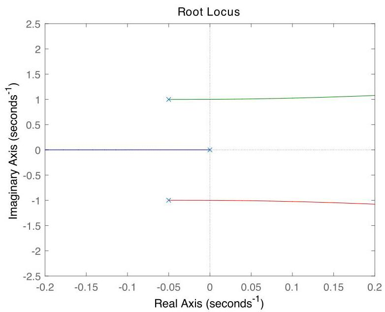

# Solution

## Method

We have

\[
\ddot{x} + \alpha \dot{x} + {\beta x} = \gamma \left( {f + \delta} \right),
\]

where

\[
\alpha = \frac{b}{m},\;\beta = \frac{k}{m},\;\gamma = \frac{1}{m},\;\delta = {mg}\sin \theta,
\]

leading to the open-loop transfer-function

\[
G\left( s \right) = \frac{\gamma}{{s}^{2} + {\alpha s} + \beta}.
\]

With the given physical parameters, this corresponds to a stable, lightly damped second-order system with \( {\omega }_{n} = 1 \) and \( \zeta = {0.05} \). The constant input disturbance requires us to select a controller with a pole at the origin. The simplest possible candidate is

\[
K\left( s \right) = \frac{K}{s}.
\]

The loop transfer-function

\[
L = \frac{G}{s} = \frac{\gamma}{s\left( {{s}^{2} + {\alpha s} + \beta} \right)}
\]

has two complex stable poles and one pole at the origin and no zeros. The resulting root-locus plot looks like:

and internal stability follows for a sufficiently small \( K > 0 \), say \( K = {0.05} \). A more sophisticated controller is needed if one wants to avoid the rapidly escape of the complex roots to the right-hand side of the complex plane.

## Teaching Points

1. Modeling mechanical systems using differential equations
2. Interpretation of constant disturbances in control systems
3. Role of integral action in disturbance rejection
4. Root-locus analysis of higher-order systems
5. Trade-off between simplicity and performance in controller design
