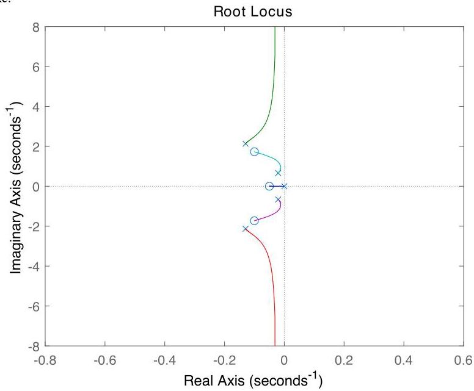

# Solution

## Method

Using the state-space representation from P5.26:

\[
\dot{x} = \left\lbrack  \begin{matrix}  - \frac{{b}_{1} + {b}_{2}}{{m}_{1}} &  - \frac{{k}_{1} + {k}_{2}}{{m}_{1}} & \frac{{b}_{2}}{{m}_{1}} & \frac{{k}_{2}}{{m}_{1}} \\  1 & 0 & 0 & 0 \\  \frac{{b}_{2}}{{m}_{1}} & \frac{{k}_{2}}{{m}_{2}} &  - \frac{{b}_{2}}{{m}_{2}} &  - \frac{{k}_{2}}{{m}_{2}} \\  0 & 0 & 1 & 0 \end{matrix}\right\rbrack  x + \left\lbrack  \begin{matrix} \frac{1}{{m}_{1}} & 0 \\  0 & 0 \\  0 & \frac{1}{{m}_{2}} \\  0 & 0 \end{matrix}\right\rbrack  \left( \begin{array}{l} {f}_{1} \\  {f}_{2} \end{array}\right)
\]

\[
y = \left\lbrack  \begin{array}{llll} 0 & 0 & 0 & 1 \end{array}\right\rbrack  x
\]

where \( u = \left( {{f}_{1},{f}_{2}}\right) \).

Using Matlab, we calculate the open-loop transfer-functions

\[
{G}_{1}\left( s\right)  = \frac{Y\left( s\right) }{{F}_{1}\left( s\right) } = \frac{{0.1s} + 2}{{s}^{4} + {0.3}{s}^{3} + {5.01}{s}^{2} + {0.3s} + 2},
\]

\[
{G}_{2}\left( s\right)  = \frac{Y\left( s\right) }{{F}_{2}\left( s\right) } = \frac{{s}^{2} + {0.2s} + 3}{{s}^{4} + {0.3}{s}^{3} + {5.01}{s}^{2} + {0.3s} + 2},
\]

which have two pairs of complex conjugate poles in the open left-half plane. In order to analyze the impact of a constant disturbance \( {f}_{1} \) we shall first note that

\[
{G}_{1}\left( s\right)  = T\left( s\right) {G}_{2}\left( s\right) ,\;T\left( s\right)  = \frac{{0.1}\left( {s + {20}}\right) }{{s}^{2} + {0.2s} + 3}
\]

where \( T \) is asymptotically stable. Therefore, the transfer-function from the disturbance force \( {f}_{1} \) to the closed-loop output \( y \) is given by

\[
T\left( s\right) D\left( s\right)  = T\left( s\right) {G}_{2}\left( s\right) S\left( s\right)
\]

Since \( T\left( s\right) \) does not have a pole at zero, asymptotic rejection of a constant disturbance will happen if \( D\left( s\right) \) has a zero at the origin, which will be the case if, once again, the controller has a pole at the origin. With

\[
K\left( s\right)  = \frac{K\left( {s + z}\right) }{s}
\]

the resultant loop transfer-function

\[
L = \frac{\left( {s + z}\right) {G}_{2}}{s} = \frac{\left( {s + z}\right) \left( {{s}^{2} + {0.2s} + 3}\right) }{s\left( {{s}^{4} + {0.3}{s}^{3} + {5.01}{s}^{2} + {0.3s} + 2}\right) }
\]

has four complex stable poles and one pole at the origin, two complex stable zeros and one real pole at \( - z \). By having a small \( z \), say \( z = {0.05} \), one will have two stable asymptotes. The resulting root-locus plot looks like:

and internal stability follows for any \( K > 0 \). A more sophisticated controller is needed if one wants to avoid oscillations.

## Teaching Points

1. Modeling coupled mechanical systems in state space
2. Disturbance rejection via integral action
3. Interpretation of multivariable transfer functions
4. Root-locus design for higher-order systems
5. Trade-offs betwe
