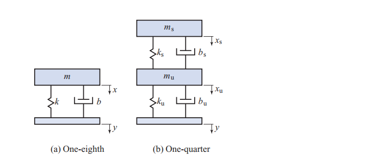

# Problem

## Problem Description

The mass-spring-damper diagram in Figure 6.26(b) is an improved version of the model considered which is used to model the wheel-body dynamics of a car [Jaz08, Chapter 15]. It is known as the one-quarter-car model. The mass \( {m}_{\mathrm{s}} \) represents \( 1/4 \) of the mass of the car without the wheels and \( {m}_{\mathrm{u}} \) represents the mass of a single wheel. The constants \( {k}_{\mathrm{s}} \) and \( {b}_{\mathrm{s}} \) are the stiffness and damping coefficient of the spring and shock absorber. The constants \( {k}_{\mathrm{u}} \) and \( {b}_{\mathrm{u}} \) are the stiffness and damping coefficient of the tire. The ordinary differential equations

\[
{m}_{\mathrm{s}}{\ddot{x}}_{\mathrm{s}} + {b}_{\mathrm{s}}\left( {{\dot{x}}_{\mathrm{s}} - {\dot{x}}_{\mathrm{u}}}\right)  + {k}_{\mathrm{s}}\left( {{x}_{\mathrm{s}} - {x}_{\mathrm{u}}}\right)  = 0,
\]

\[
{m}_{\mathrm{u}}{\ddot{x}}_{\mathrm{u}} + \left( {{b}_{\mathrm{u}} + {b}_{\mathrm{s}}}\right) {\dot{x}}_{\mathrm{u}} + \left( {{k}_{\mathrm{u}} + {k}_{\mathrm{s}}}\right) {x}_{\mathrm{u}} - {b}_{\mathrm{s}}{\dot{x}}_{\mathrm{s}} - {k}_{\mathrm{s}}{x}_{\mathrm{s}} = {k}_{\mathrm{u}}y + {b}_{\mathrm{u}}\dot{y}
\]

constitute a simplified description of the motion of the one-quarter-car model, where \( {x}_{\mathrm{s}} \) and \( {x}_{\mathrm{u}} \) are displacements measured from equilibrium. If

\[
x = {x}_{\mathrm{s}} - {x}_{\mathrm{u}},\;z = {x}_{\mathrm{u}} - y,
\]

show that

\[
{m}_{\mathrm{s}}{m}_{\mathrm{u}}\ddot{x} + {b}_{\mathrm{s}}\left( {{m}_{\mathrm{s}} + {m}_{\mathrm{u}}}\right) \dot{x} + {k}_{\mathrm{s}}\left( {{m}_{\mathrm{s}} + {m}_{\mathrm{u}}}\right) x - {b}_{\mathrm{u}}{m}_{\mathrm{s}}\dot{z} - {k}_{\mathrm{u}}{m}_{\mathrm{s}}z = 0,
\]

\[
{m}_{\mathrm{u}}\ddot{z} + {b}_{\mathrm{u}}\dot{z} + {k}_{\mathrm{u}}z - {b}_{\mathrm{s}}\dot{x} - {k}_{\mathrm{s}}x =  - {m}_{\mathrm{u}}\ddot{y},
\]

where \( y \) is the road profile.

Fig.2.26
## Subproblems

1. Interpret the physical meaning of each mass, spring, and damper in the model.
2. Define the relative displacement variables \( x \) and \( z \).
3. Manipulate the original equations to eliminate absolute displacements.
4. Derive the coupled differential equations in terms of \( x \) and \( z \).
5. Identify how road acceleration enters the dynamics.
6. Discuss the coupling between suspension and tire dynamics.
7. Explain the benefits of using relative coordinates.

## Additional Information

- All displacements are measured from static equilibrium.
- Road input \( y \) is assumed to be sufficiently smooth.
- Linear spring and damper models are assumed.
- Gravitational effects are already compensated.

## Constraints

- Algebraic manipulation must preserve physical consistency.
- No numerical parameter values are required.
- Only time-domain analysis is used.
- Coordinate transformations must be clearly defined.
