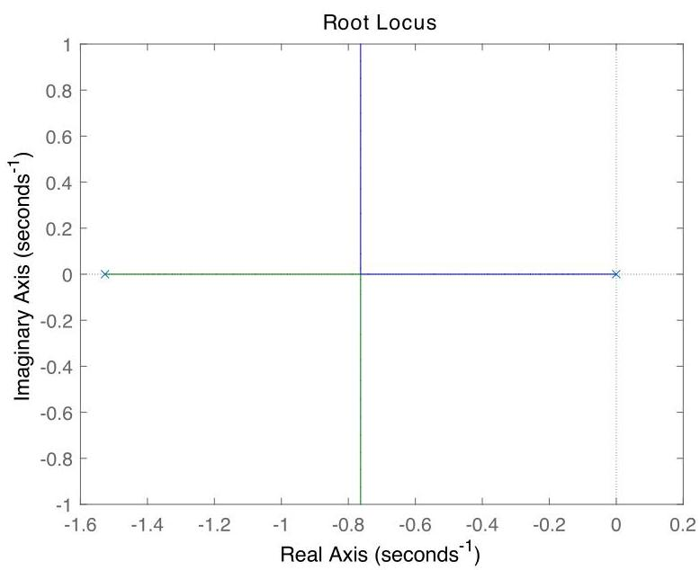

# Solution

## Method
We have

\[
G\left( s\right)  = \frac{\beta }{s + \alpha },\;\alpha  = \frac{b}{J} + \frac{{K}_{e}{K}_{t}}{J{R}_{a}},\;\beta  = \frac{{K}_{t}}{J{R}_{a}}.
\]

To asymptotically track constant reference inputs, we require an additional pole at the origin. For instance, the controller with transfer-function \( K\left( s\right)  = K/s \) achieves the design goal. The corresponding loop transfer-function is

\[
L\left( s\right)  = \frac{\beta }{s\left( {s + \alpha }\right) }.
\]

For the given data the root-locus plot looks like:

Internal asymptotic stability is guaranteed for all \( K > 0 \). A good choice is \( K \approx  {0.046} \) which places the closed-loop poles where they branch off the real axis.

## Teaching Points
1. Modeling of electromechanical systems using linear differential equations
2. Interpretation of steady-state tracking in terms of system type
3. Role of integral action in eliminating steady-state error
4. Construction and interpretation of root-locus plots
5. Relationship between controller gain and closed-loop pole locations
6. Stability guarantees from root-locus structure
