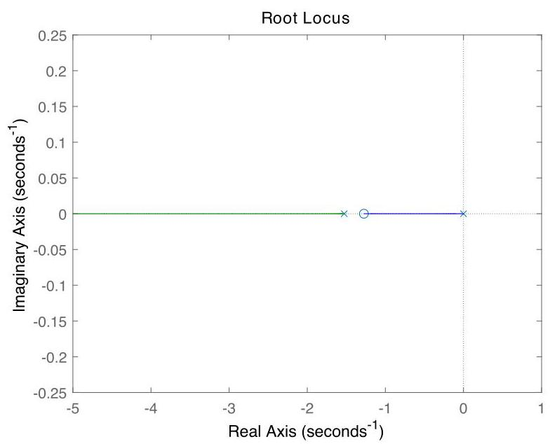

# Solution

## Method
We have

\[
G\left( s\right)  = \frac{s + \beta }{s + \alpha },\;\alpha  = \frac{b}{J} + \frac{{K}_{e}{K}_{t}}{J{R}_{a}},\;\beta  = \frac{b}{J}.
\]

To asymptotically track constant reference inputs, we require an additional pole at the origin. For instance, the controller with transfer-function \( K\left( s\right)  = K/s \) achieves the design goal. The corresponding loop transfer-function is

\[
L\left( s\right)  = \frac{\left( s + \beta \right) }{s\left( {s + \alpha }\right) }.
\]

For the given data the root-locus plot looks like:

\[
G\left( s\right)  = \frac{\beta }{s + \alpha },\;\alpha  = \frac{1}{Rmc},\;\beta  = \frac{1}{mc}.
\]

Internal asymptotic stability is guaranteed for all \( K > 0 \).

## Teaching Points
1. Torque control of DC motors using classical control techniques
2. Interpretation of zeros and poles in electromechanical systems
3. Relationship between system type and steady-state tracking
4. Integral action as a means to eliminate steady-state error
5. Root-locus stability analysis with pole–zero cancellation avoided
6. Effect of plant zeros on tran
