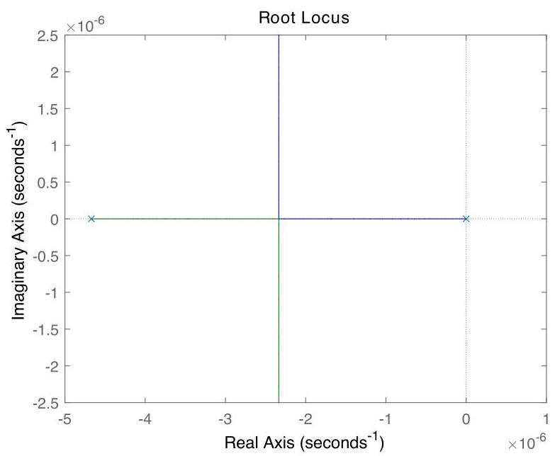

# Solution

## Method
To ensure asymptotic tracking of constant reference inputs, we require a controller pole at the origin, say \( K\left( s\right)  = {K}_{p}/s \). The corresponding loop transfer-function is:

\[
L = \frac{G}{s} = \frac{\beta }{s\left( {s + \alpha }\right) }
\]

with poles at \( \{  - \alpha ,0\} \) and no zeros.

For the given data the root-locus plot looks like:

\[
G\left( s\right)  = \frac{\beta }{s + \alpha },\;\alpha  = \frac{w}{m} + \frac{1}{Rmc},\;\beta  = \frac{1}{mc}.
\]

As can be verified using the root-locus method, a controller of the form achieves the design goals for all \( K > 0 \).

## Teaching Points
1. Thermal system modeling using energy balance equations
2. Interpretation of system type in temperature control
3. Necessity of integral action for zero steady-state error
4. Root-locus construction for first-order plants
5. Stability guarantees from pole migration
6. Physical interpretation of controller gain in heating systems
