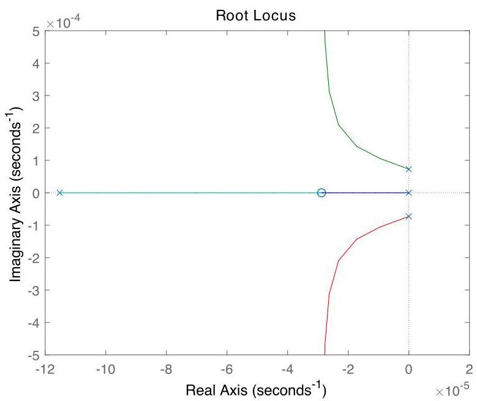

# Solution

## Method
In this case, with \( w \neq  0 \), we have

\[
G\left( s\right)  = \frac{\beta }{s + \alpha },\;\alpha  = \frac{\bar{w}}{m} + \frac{1}{mcR},\;\beta  = \frac{1}{mc}.
\]

To ensure asymptotic tracking of a constant plus sinusoidal reference inputs, we require controller poles at \( s = 0 \) and \( s =  \pm  {j\omega } \), say

\[
K\left( s\right)  = \frac{\left( {s + {z}_{1}}\right) \left( {s + {z}_{2}}\right) }{s\left( {{s}^{2} + {\omega }^{2}}\right) }.
\]

The corresponding loop transfer-function is:

\[
L = \frac{G}{s} = \frac{\beta \left( {s + {z}_{1}}\right) \left( {s + {z}_{2}}\right) }{s\left( {s + \alpha }\right) \left( {{s}^{2} + {\omega }^{2}}\right) }.
\]

with poles at \( \{  - \alpha ,0,{j\omega }, - {j\omega }\} \) and zeros at \( \left\{  {-{z}_{1}, - {z}_{2}}\right\} \). The zeros can be chosen with small negative real part so as to lead to a pair of stable asymptotes. For example,

\[
{z}_{1} = {z}_{2} = \alpha /4.
\]

For the given data the root-locus plot looks like:

As can be verified using the root-locus method, a controller of the form achieves the design goals for all \( K > 0 \).

## Teaching Points
1. Modeling of periodic disturbances in thermal systems
2. Application of the internal model principle
3. Tracking of constant plus sinusoidal reference signals
4. Controller pole placement at imaginary-axis frequencies
5. Root-locus design with higher-order controllers
6. Role of controller zeros in shaping asymptotes and stability
