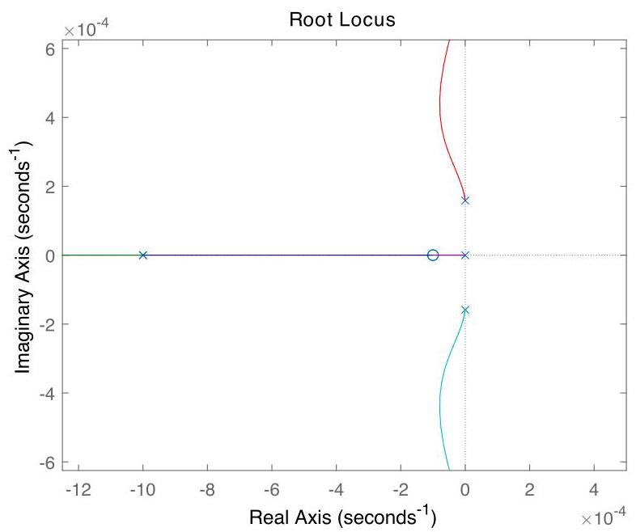

# Solution

## Method
With the given parameters, the transfer-function is approximately

\[
G\left( s\right)  = \frac{{1.9} \times  {10}^{-7}}{s\left( {{s}^{2} + {2.5} \times  {10}^{-8}}\right) },
\]

which has a pole at the origin and a pair of imaginary poles.

To ensure asymptotic stability we add two stable zeros followed by two stable poles, for example:

\[
K\left( s\right)  = \frac{{\left( s + z\right) }^{2}}{{\left( s + p\right) }^{2}}.
\]

The corresponding loop transfer-function is:

\[
L = \frac{G}{s}
= \frac{{1.9} \times  {10}^{-7}{\left( s + z\right) }^{2}}
{s\left( {{s}^{2} + {2.5} \times  {10}^{-8}}\right) {\left( s + p\right) }^{2}}.
\]

This loop transfer-function has poles at

\[
\{ 0,{j\omega }, - {j\omega }, - p, - p\},
\quad
\omega  \approx  {0.158} \times  {10}^{-3},
\]

and zeros at

\[
\{  - z, - z\}.
\]

The zeros can be chosen with small negative real part so as to lead to a pair of stable asymptotes. For example,

\[
z = {0.0001}, \quad p = {0.001}.
\]

For the given data the root-locus plot looks like:

\[
u = \bar{u} + K\left( {\bar{y} - g\left( {\bar{x},\bar{u}}\right)  - y}\right).
\]

As can be verified using the root-locus method, a controller of the proposed form achieves the design goals for sufficiently small \( K > 0 \).

## Teaching Points
1. Linearized orbital dynamics and equilibrium orbits
2. Marginal stability caused by integrators and imaginary-axis poles
3. Transfer-function extraction from state-space models
4. Dynamic compensation using pole–zero cancellation shaping
5. Root-locus stabilization of oscillatory systems
6. Physical interpretation of thrust-based orbital control
