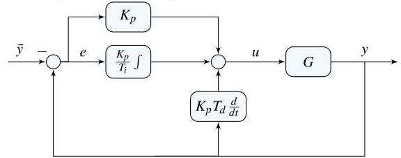

# Solution

## Method
One possible block diagram is:

IMPORTANT: Note the "positive" feedback loop because the plant \( G \) has a negative static gain.

Except for the sign convention, the controller described by (6.26) is a
**Proportional–Integral–Derivative (PID) controller**.

As discussed in §5.8 of the textbook, implementation of a controller based on a linearized system requires offsetting the inputs and outputs. Because \( \bar{y} \) is constant and the controller \( K \) is linear, the control law can be written as

\[
u = K\left( {\bar{y} - y}\right) + \bar{w},
\quad
\bar{w} = \bar{u} - g\left( {\bar{x},\bar{u}}\right),
\]

where \( \bar{w} \) can be interpreted as a constant disturbance acting on the input.

Because the controller contains an integrator, this constant disturbance is rejected in closed-loop, ensuring regulation of the glucose level about \( \bar{y} \).

## Teaching Points
1. Interpretation of negative plant gain in biological systems
2. PID control structures in physiological regulation
3. Positive versus negative feedback depending on plant sign
4. Offset handling in linearized control implementations
5. Role of integral action in homeostasis and disturbance rejection
6. Difference between regulating absolute variables and deviations from equilibrium
