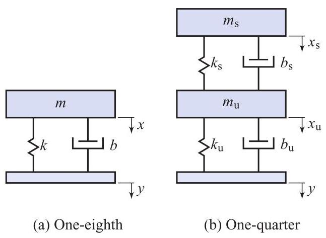

# Problem

## Problem Description
The mass-spring-damper diagram in Figure 6.26(a) is used to model the suspension dynamics of a car [Jaz08, Chapter 14], and is known as the one-eighth-car model. The mass \( m \) represents 1/4 of the total mass of the car. The constants \( k \) and \( b \) are the stiffness and damping coefficient of the spring and shock absorber. The ordinary differential equation

\[
m\ddot{x} + b\dot{x} + {kx} = b\dot{y} + {ky}
\]

constitutes a simplified description of the motion of this model, where \( x \) is a displacement measured from equilibrium. Show that, if \( z = x - y \) ,

\[
m\ddot{z} + b\dot{z} + {kz} =  - m\ddot{y},
\]

where \( y \) is the road profile.

Figure 6.26 One-eighth- and one-quarter-car models, P6.19 and P6.24.

## Subproblems
1. Express the absolute displacement \( x \) and its first and second time derivatives in terms of the relative displacement \( z \) and the road profile \( y \).
2. Substitute these expressions into the original differential equation of the car's motion.
3. Perform algebraic simplification to derive the final differential equation involving \( z \).

## Additional Information
- The variable \( z = x - y \) represents the suspension deflection (the relative movement between the car body and the road).
- Assume the road profile \( y(t) \) is a twice-differentiable function of time.
- The model assumes linear behavior for both the spring and the damper.

## Constraints
- All steps of the algebraic substitution must be clearly shown.
- Use standard dot notation (\( \dot{x}, \ddot{x} \)) to represent time derivatives.
- The final result must be expressed in terms of \( m, b, k, z \) and its derivatives on the left side, and \( m \) and the road acceleration on the right side.