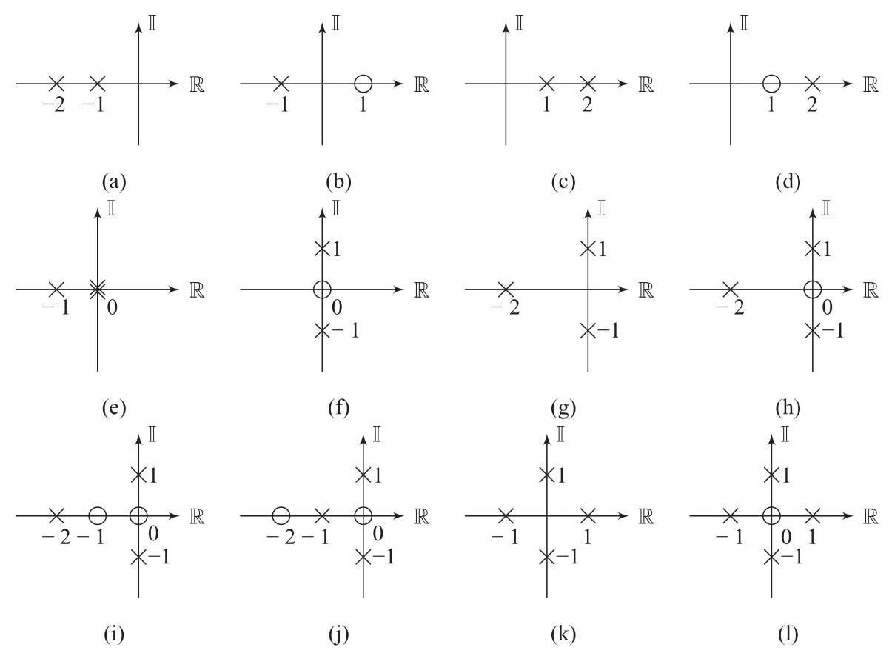

# Problem

## Problem Description

Find a minimum-phase rational transfer-function that matches the Bode magnitude diagrams in Fig. 7.33. The straight-line approximations are plotted as thin lines.

Figure 7.32 Pole-zero diagrams for P7.5–P7.7.

## Subproblems

1. Identify the corner (break) frequencies from each Bode magnitude plot.
2. Determine the slope changes in the magnitude plot and associate them with poles or zeros.
3. Decide whether each corner corresponds to a real pole, real zero, or a complex-conjugate pole pair.
4. Construct a minimum-phase rational transfer function consistent with the straight-line asymptotes.
5. Determine the appropriate static gain to match the magnitude level.
6. Verify that all zeros lie in the left half-plane to ensure minimum-phase behavior.
7. Match each Bode magnitude diagram (a–p) to its corresponding transfer function.

## Additional Information

- All transfer functions are assumed to be linear, time-invariant, and rational.
- Only minimum-phase systems are considered.
- Straight-line Bode magnitude approximations are used for identification.
- Constant gain factors are selected to match the magnitude level of the plots.
- Phase information is not explicitly shown but is implied by minimum-phase assumptions.

## Constraints

- All identified systems must be minimum-phase.
- Only magnitude information from the Bode plots may be used.
- Transfer functions should be expressed in factored or polynomial form.
- Each transfer function must be proper or strictly proper.
- Standard control-system conventions must be followed.
