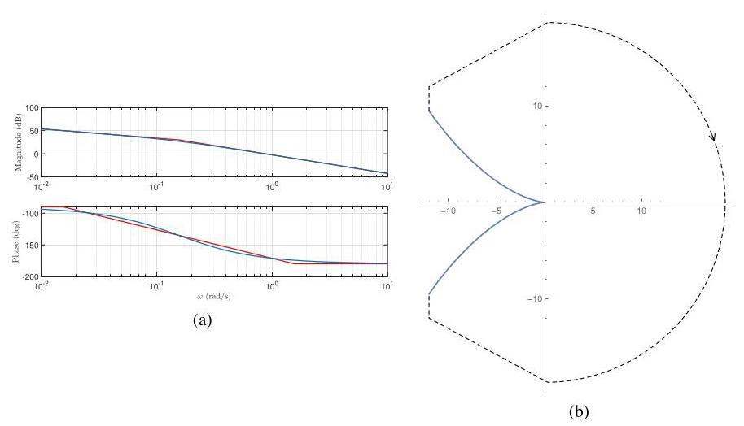
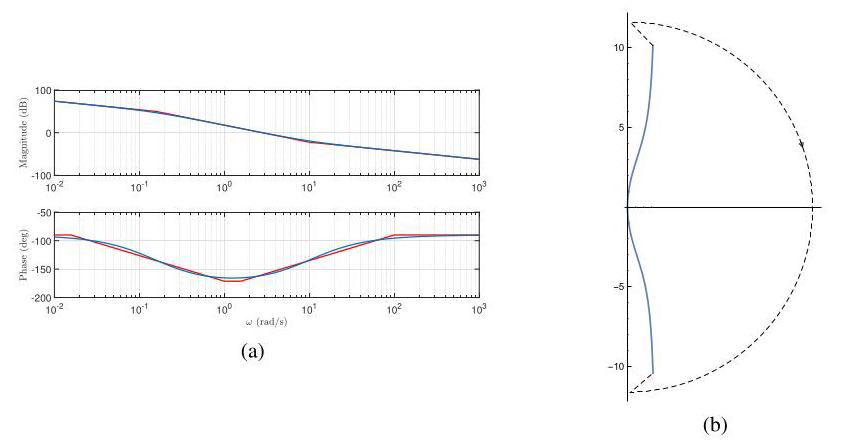
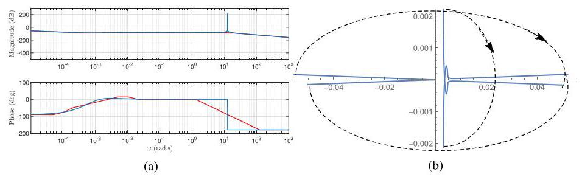

# Solution

## Method

We recall that our system dynamics are described by the following equation

\[
\left( {{J}_{1}{r}_{2}^{2} + {J}_{2}{r}_{1}^{2}}\right) {\dot{\omega }}_{1}
+\left( {{b}_{1}{r}_{2}^{2} + {b}_{2}{r}_{1}^{2}}\right) {\omega }_{1}
= {r}_{2}\left( {{r}_{2}{\tau }_{1} + {r}_{1}{\tau }_{2}}\right).
\]

We get the following transfer function between \( {\omega }_{2} \) and \( {\tau }_{1} \),

\[
G\left( s\right) = \beta /\left( {s + \alpha }\right),
\]

\[
\beta = {r}_{1}{r}_{2}/{J}_{r}.
\]

Figure G.7 Bode plots and Nyquist diagram for 7.12.

Figure G.8 Bode and polar plots for 7.13 with \( {K}_{i}/{K}_{p} = 10 \).

Tracking a constant reference input while rejecting the sinusoidal disturbance demands a controller with a single pole at the origin and a pair of complex conjugate poles on the imaginary axis, that is:

\[
K\left( s\right)
= K\frac{\left( {s + {z}_{1}}\right) \left( {s + {z}_{2}}\right) }
{s\left( {{s}^{2} + {\eta }^{2}}\right)}.
\]

We added the zeros because without them closed-loop stability is not possible (verify). Furthermore, given that the controller has three poles, we have the flexibility to place up to three additional open-loop zeros. With two zeros, the loop transfer-function

\[
L
= \frac{\left( {s + {z}_{1}}\right) \left( {s + {z}_{2}}\right) G}
{s\left( {{s}^{2} + j{\eta }^{2}}\right)}
= \frac{\beta \left( {s + {z}_{1}}\right) \left( {s + {z}_{2}}\right) }
{s\left( {s + \alpha }\right) \left( {{s}^{2} + {\eta }^{2}}\right)}
\]

has poles at \( \{ -\alpha, 0, j\eta, -j\eta \} \) and zeros at
\( \{ -z_{1}, -z_{2} \} \).
We have \( \eta = 4\pi \) and select
\( z_{1} = \alpha /2 \) and
\( z_{2} = \alpha /4 \).

As seen in the polar plot in Figure G.9, no point on the negative real axis is encircled. Given that the open-loop transfer function has no poles in the right-hand plane, this guarantees asymptotic stability for any \( K > 0 \).

Figure G.9 Bode plots and Nyquist diagram for 7.14.

## Teaching Points

1. Application of the internal model principle for tracking and disturbance rejection
2. Use of dynamic controllers with integrators and resonant poles
3. Interpretation of Bode plots for controller shaping
4. Nyquist stability analysis with imaginary-axis poles
5. Role of controller zeros in achieving closed-loop stability
6. Relationship between frequency-domain specifications and time-domain performance
7. Gain and phase margin interpretation for robustness assessment
